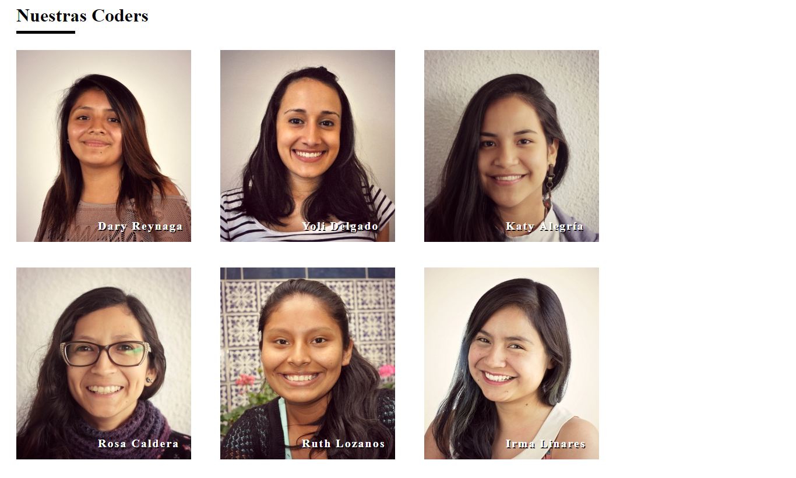

# **Nuestras Coders**
En este trabajo hicimos uso de div que contienen cada imagen y un texto con los nombres de cada coder, para ponerlos encima de la imagen usamos position absolute y al div que contien la imagen, el texto hicimos uso de position relative pero las condiciones del trabajo era q esten una al lado del otro asi que usamos float left en el body.

### Imagen

